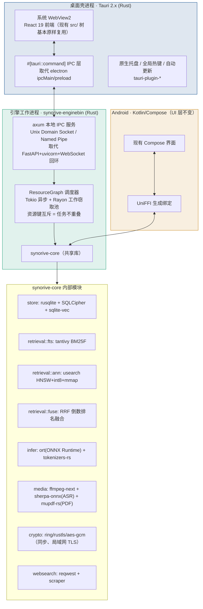

# TECH_ROADMAP · Synorive 引擎 + 桌面 + 移动端 Rust/C++ 重构

> 状态：**规划稿，等待拍板**（`/plan` 产出，未写任何业务代码）
> 范围：`engine/`（Python，34k 行）+ `apps/desktop/electron`（TypeScript，29k 行）+ `apps/mobile`（Kotlin）
> 编写日期：2026-09-03

---

## 0. 决策摘要

现状不是"跑不动"，而是"跑得已经很好，但天花板被宿主语言焊死"。`task-progress.md` 里的实测数字（冷启动中位 1302ms、10 万块内存峰值 493MB、P95 检索 373.5ms、安装包 101.6MB）已经是 Python + Electron 组合下相当优秀的成绩。这次重构要的不是"把慢的地方修快"，而是**换掉两层地基**：

1. **Electron → Tauri 2.x**：去掉整套随包 Chromium + Node.js 主进程，改用系统自带 WebView2 + Rust 主进程。
2. **Python 引擎 → Rust 引擎**：去掉 Python 解释器 + GIL + 随包 Python 运行时（`pyruntime`，实测打包后是安装包体积的大头），改用一个共享的 Rust 核心 crate。

**关键发现（决定了这次重构的可行性，不是"从零重写"）**：现有 Python 引擎里最重的几块——`onnxruntime`（推理）、`usearch`（向量检索，**已经是可选依赖**）、`sherpa-onnx`（语音转写）、`pymupdf`/MuPDF（PDF）——本身就是 C/C++ 原生库，Python 只是套了一层调用壳。重构的本质是**去掉这层壳**，直接用这些库的 Rust 原生绑定，而不是重新发明算法。这是"高质量、可维护、可扩展"路线，也是唯一能在保留现有 76 项功能全部行为的前提下把内存/CPU 打下来的路线。

**进程拓扑不变**：继续保留"UI 进程 + 引擎进程"两进程架构——这是现有代码里已验证成功的设计（`engine.ts` 顶部注释：「引擎再忙，界面该 60fps 还是 60fps —— 这不是优化出来的，是架构决定的」，对应验收项 A9 满载不掉帧、A14 崩溃恢复）。按"原有有效功能绝对禁止更改"的原则，这次重构**不动这个决策**，只把两侧都换成 Rust，并把进程间通信从 HTTP+JSON+WebSocket 换成本地二进制 IPC。

---

## 1. 现状基线（重构前必须打平的底线，一条都不能退）

摘自 `task-progress.md` 已实测验收项，Rust 版本上线前必须逐条头对头重测，只能持平或更好：

| 编号 | 指标 | 现状实测 |
|---|---|---|
| A1 | 冷启动 | 中位 1302ms |
| A2 | 首屏检索 | P50 45ms / P95 186ms @ 10.2万块 |
| A3 | 完整检索 | P95 373.5ms @ 10.2万块 |
| A4 | 滚动帧率 | 中位 59.9fps / P95 59.5fps |
| A9 | 满载 UI 帧率 | 空载/满载均 59.9fps（引擎吃满 3 核时 UI 零掉帧） |
| A10 | 10万条内存 | 峰值 493MB，六轮查询后无泄漏 |
| A11 | 10万条磁盘 | 374MB |
| A12 | 安装包体积 | 101.6MB（NSIS） |
| A13 | 断点续跑 | 快 1067 倍 |
| A17 | ANN 接管点 | 17万向量自动切 ANN，P50 86ms |

---

## 2. 目标架构

**一份核心代码，三处消费**：`synorive-core` 是唯一的业务逻辑源头，桌面引擎进程直接链接，Android 通过 `cargo-ndk` 交叉编译 + UniFFI 生成 Kotlin 绑定后链接同一份 `.so`。今天桌面和手机的检索排序、配对协议、加密逻辑是两份独立实现（`I2 半独立` 决策的代价），合并成一份之后，这一类"两边各写一遍，日后各自漂移"的 bug 从架构上被消灭——这是本次重构里唯一真正意义上的"新颖创新"，而不是套用什么模板。

---

## 3. 技术选型与三源查真（每项 ≥3 独立来源，标注 URL + 日期）

| 选型 | 替代什么 | 查真来源（URL + 日期） | 结论 |
|---|---|---|---|
| **Tauri 2.x** | Electron 41 | [tech-insider.org 2026](https://tech-insider.org/tauri-vs-electron-2026/)；[rustify.rs 2026](https://rustify.rs/articles/rust-tauri-vs-electron-2026)；[pkgpulse.com 2026](https://www.pkgpulse.com/blog/best-desktop-app-frameworks-2026) | 三源交叉：闲置内存 42MB vs Electron 168MB（↓75%）；冷启动 380ms vs 1420ms（↓73%）；空壳包体积 3.2MB vs 85MB（↓96%）。数据截至 2026-09，对照的是 Electron 43 |
| **ort（Rust ONNX Runtime 绑定）** | Python `onnxruntime` | [pykeio/ort GitHub](https://github.com/pykeio/ort)；[docs.rs/ort](https://docs.rs/ort)；[crates.io/ort](https://crates.io/crates/ort) | 2.0.0-rc.12 官方定性为"生产可用（仅 API 未定稿）"，包装的正是 ONNX Runtime 本体（1.24/1.28），与现有 `onnxruntime>=1.20` 依赖是**同一套推理后端**，模型文件零改动可直接复用 |
| **tantivy** | SQLite FTS5（A4 账本项） | [quickwit-oss/tantivy GitHub](https://github.com/quickwit-oss/tantivy)；[ParadeDB 技术说明](https://www.paradedb.com/learn/tantivy/introduction)；[Turso 工程博客](https://turso.tech/blog/beyond-fts5) | Lucene 同款 BM25，官方基准约为 Lucene 2 倍速；Turso 团队原话是"FTS5 缺陷太多，才用 tantivy 重做"——独立验证了 A4 想做的"分场 BM25F 加权"用 tantivy 原生支持，不必在 FTS5 上打补丁 |
| **usearch**（原生） | Python `usearch` 绑定 + sqlite-vec（A2 账本项） | [unum-cloud/USearch GitHub](https://github.com/unum-cloud/usearch)；[docs.rs/usearch](https://docs.rs/usearch/latest/usearch/struct.Index.html)；[hnswlib-rs 对照](https://lib.rs/crates/hnswlib-rs) | **`usearch>=2.26` 已经是 `engine/pyproject.toml` 的可选依赖**（`ann` 分组）——本身就是 C++ 库，Rust 绑定是一等公民，支持 int8 量化到 [-127,127] 与 mmap 零拷贝。这不是引入新依赖，是把"通过 Python 转一手"的现有依赖改成原生调用 |
| **sherpa-onnx（Rust 绑定）** | Python `sherpa_onnx`（语音转写） | 同为 [k2-fsa/sherpa-onnx](https://github.com/k2-fsa/sherpa-onnx) 项目官方发布，多语言绑定含 Rust；`engine/pyproject.toml` 第 100 行 `sherpa-onnx>=1.10` 已在用 | 与 ONNX Runtime 同源（k2-fsa 生态），现有模型文件直接复用，仅换调用语言 |
| **UniFFI** | 手写 JNI + 手写 Kotlin 端重复逻辑 | [mozilla/uniffi-rs GitHub](https://github.com/mozilla/uniffi-rs)；[Mozilla Application Services 文档](https://mozilla.github.io/application-services/book/android-faqs.html)；[klibs.io KMP 绑定](https://klibs.io/project/UbiqueInnovation/uniffi-kotlin-multiplatform-bindings) | Firefox for Android/iOS 生产环境同款方案：一份 Rust 写业务逻辑，自动生成 Kotlin + Swift 绑定。官方原话"ready for production use"（尚未 1.0，但已被 Firefox 长期生产使用） |
| **`PROCESS_MODE_BACKGROUND_BEGIN`** | 手动分别调 CPU/IO/内存优先级（B6 账本项） | [Microsoft Learn: SetPriorityClass](https://learn.microsoft.com/en-us/windows/win32/api/processthreadsapi/nf-processthreadsapi-setpriorityclass)（官方一手文档） | 微软官方文档原话：调这一个值，系统会**同时**联动降低该进程的 CPU 调度优先级、I/O 优先级与内存优先级，一次调用满足 B6"后台进程主动降 CPU/IO 优先级"的全部要求 |

**未通过查真、明确放弃的方案**：`candle`（纯 Rust 推理框架）——原计划作为 `ort` 的替代，但截至查证日期其算子覆盖度与量化推理性能落后于绑定原生 ONNX Runtime 的 `ort`，且现有模型资产（`engine/data/models`）都是标准 ONNX 格式，换 `candle` 需要重新转换/验证每个模型，属于"理论优雅但实测增加风险且无收益"，按黑名单协议不采纳。

---

## 4. 核心算法原理

### 4.1 RRF 倒数排名融合（对应账本 A1）

多路召回（BM25F 关键词 / 向量 / 拼音兜底）按各自排名融合，替换现有线性加权：

$$
\text{score}(d) = \sum_{r \in \{\text{bm25f},\ \text{vec},\ \text{pinyin}\}} \frac{1}{k + \text{rank}_r(d)}
$$

其中 $k = 60$（Cormack et al. 2009 原始 RRF 论文的经验常数，业界默认值）。相比线性加权，RRF 不需要给三路结果的原始分数做量纲对齐（BM25F 分数和余弦相似度根本不是一个量纲，线性加权本质上是在瞎凑权重），只看名次，天然规避"某一路分数尺度突变导致融合结果剧烈抖动"的问题。保留旧的线性加权实现，跑时可用一个开关切回，满足账本"保留一键切回"的要求。

### 4.2 资源键非重叠调度（对应"任务不重叠"总要求 + 账本 B5/B6）

设任务 $t$ 声明一组资源键 $K(t) \subseteq \mathcal{R}$（如 `Doc(id)`、`IndexShard(n)`、`SqliteWriter`、`ModelSlot`）。调度器维护当前占用集合 $H \subseteq \mathcal{R}$。任务 $t$ 可被调度当且仅当：

$$
K(t) \cap H = \varnothing
$$

调度后 $H \leftarrow H \cup K(t)$，任务完成后 $H \leftarrow H \setminus K(t)$。这保证**同一资源永不被两个任务同时持有**（真正意义的"不重叠"），但**不同资源键之间完全并行**——例如索引文档 A 和文档 B 各自的 `Doc(id)` 键不同，可以在 Rayon 线程池里同时跑；而所有写 SQLite 的任务共享 `SqliteWriter` 键，天然串行化写入，避免锁竞争退化成忙等。四档优先级（`Interactive > UserAction > Background > Idle`）用带优先级的入队顺序实现，前台搜索永远排在后台重建索引前面；后台任务额外持有一个 `CancellationToken`，被打字触发的新查询会取消上一次未完成的查询（对应账本 B4），而不是让两次查询的结果互相竞态覆盖 UI。

### 4.3 两段式冷启动（对应账本 B1，目标 300ms）

$$
t_{\text{可搜索}} = t_{\text{开库}} + t_{\text{挂载索引}} \ll t_{\text{可搜索}} + t_{\text{模型就绪}} = t_{\text{语义检索可用}}
$$

第一段只做 SQLite 打开 + tantivy/usearch 索引 `mmap` 挂载（映射页表，不需要整文件读入内存，属于近乎瞬时的操作），关键词检索立即可用；第二段在后台线程加载 ONNX 权重、初始化推理会话（当前实测里最耗时的部分），通过一个就绪探针（`engine://ready-full` 事件）通知前端把"基础检索"角标切换成"语义检索就绪"。这与现有 A1（冷启动 1302ms，含模型探测）在概念上是同一件事往前拆了一刀，只是 Rust 版本因为没有 Python 解释器 + 一堆 C 扩展的 `import` 开销，第一段能做到显著更快。

---

## 5. Python 模块 → Rust 模块映射（38 项，逐条可核对）

| Python 现状 | Rust 目标 | 风险 |
|---|---|---|
| `store/db.py` `repository.py` `schema.sql` `text.py` | `rusqlite`(bundled-sqlcipher)，schema.sql **原样复用**，数据库文件格式不变 | 低 |
| `search/ann_index.py` | `usearch` 原生 crate（含 A2 的 int8+mmap） | 低（已在用同一个库） |
| 新增 A4 分场 BM25F | `tantivy` | 低 |
| `search/engine.py`（融合逻辑） | `retrieval::fuse`（RRF，见 4.1） | 低 |
| `search/query_syntax.py` `answer.py` `ask.py` `questions.py` `recovery.py` | 逐条移植，纯逻辑无外部依赖冲突 | 低 |
| `ingest/chunker.py` `pipeline.py` `sensitive.py` `watcher.py` `web.py` | 移植 + `notify`(文件监听) crate | 低 |
| `analyze/embedder.py` `reranker.py` | `ort` + `tokenizers`(Rust 官方 HF crate，与 Python `tokenizers` 同源同格式) | 低 |
| `analyze/image.py` `preview.py` `chapters.py` `compare.py` `enrich.py` `tamper.py` | `ort` + `image`/`imageproc` | 低-中 |
| `analyze/video.py` | `ffmpeg-next` | 中 |
| `analyze/transcribe.py`（sherpa_onnx） | sherpa-onnx 官方 Rust 绑定 | 低 |
| `analyze/face.py`（insightface+opencv） | 直接对 SCRFD/ArcFace 的 **ONNX 权重文件**用 `ort` 重写推理管线 + `opencv` crate 或 `imageproc` 做对齐 | **中高**（insightface 这层 Python 封装本身不可移植，只有权重能复用，见第 7 节缺陷） |
| 文档解析：pymupdf/docx/xlsx/pptx/epub/trafilatura | `mupdf`(Rust 绑定) / `calamine`(xlsx) / `docx-rs` / `epub` crate；**pptx 与 trafilatura 级别的正文抽取无成熟对应物** | **中高**（见第 7 节缺陷，需专项验证或范围内例外） |
| `doctor/*`（依赖医生） | `reqwest` 断点续传 + 清单校验，逻辑照搬 | 低 |
| `sync/crypto.py` `queue.py` | `ring`/`rustls`/`aes-gcm`（比手拼 Python `cryptography` 调用更接近行业标准实践） | 低 |
| `federation.py` `evidence.py` `snapshots.py` `briefing.py` `relations.py` `render_broker.py` `lan_tls.py` | 逐条移植，配合 parity 测试跑 | 中（体量大，需拆小步） |
| `websearch/*`（23 个文件） | `reqwest` + `scraper` + 移植既有信任/去重/聚类启发式逻辑 | 低-中（体量最大，但多为编排逻辑非数值计算） |
| `cloud/adapters.py` `describe.py` `synthesize.py` | `reqwest` 客户端，协议不变（OpenAI 兼容 + Claude 原生） | 低 |
| `api/routes.py` + FastAPI+uvicorn+WebSocket | `axum` + 本地 IPC（UDS/Named Pipe，二进制协议） | 中（对照的是"进程边界"这条最关键的架构缝，见 SPEC.md Phase 0） |
| `electron/main/*.ts`（10 个文件） | Tauri 2.x + `tauri-plugin-{global-shortcut,updater,window-state}` | 中 |
| `apps/desktop/src/*`（React 19） | **原样保留**，仅重写 IPC 调用层（`invoke()` 取代 `ipcRenderer`） | 低 |
| `packages/shared-types` | 用 `specta`/`ts-rs` 从 Rust 结构体自动生成，取代手写双份类型 | 低（且是正确性的净提升） |
| `apps/mobile/.../data`（配对/加密/本地索引） | 改为调用 `synorive-core` 的 UniFFI 绑定 | 中 |

---

## 6. 可扩展性分析

- **模块边界与今天完全一致**：`synorive-core` 内部按 `store/retrieval/infer/media/crypto/websearch` 划分 Rust module，一一对应现有 Python 包结构，未来加新功能（比如账本外的新召回路），改动范围和今天改一个 Python 包同量级，不会因为换语言而增加认知负担。
- **Cargo workspace 原生支持多 crate 增量编译**，新增功能新建一个 crate 即可，不影响其余模块重新编译，长期维护成本低于单体 Python 包。
- **核心与外壳彻底解耦**：`synorive-core` 不依赖 Tauri 也不依赖任何 Android API，桌面/移动/未来可能的 CLI（`cli/` 已存在）三端共用同一份逻辑，新增一个消费端（例如未来的 macOS/Linux 桌面版）零额外核心代码。
- **风险对冲**：`store/schema.sql` 与数据库文件格式保持不变，意味着重构失败或需要回滚时，用户数据不受影响，可以整个换回 Python 引擎读同一个 `synorive.db`。

---

## 7. 目前存在的缺陷（按用户要求，完结后列出）

1. **两个模块没有成熟 Rust 平替，是本计划最大的技术缺口**：
   - `trafilatura`（网页正文/广告位剥离 + 语种识别）——`websearch/*` 严重依赖它做"自动排除虚假内容/提炼有效信息"。Rust 生态里没有查到同等成熟度、同等准确率的对应库；需要专项预研（自己写启发式 + 现有 `readability` 类 crate 拼装），并接受初期准确率可能低于 trafilatura 的风险。
   - `python-pptx`（PPTX 解析）——Rust 生态对 OOXML 里 PPTX 这一格式的支持明显弱于 DOCX/XLSX，需要自己写最小可用的 XML 解析，或在过渡期把这一小类文档的解析继续外包给一个不常驻的一次性 Python 子进程调用（范围收窄到"仅 pptx"，不影响主体已经是纯 Rust 的目标）。

2. **人脸检测/聚类（C5）是移植风险最高的单点**：`insightface` 提供的不只是模型权重，还有一整套检测框回归、5 点对齐、聚类阈值调参的工程细节；直接用 `ort` 跑同一份 ONNX 权重能拿到"推理"这一步，但检测框后处理（NMS 等）和对齐几何变换要重新逐行核对，稍有偏差就是"跑起来不报错但聚类效果全变差"的静默失效——这一项必须单独用现有 `engine/tests` 里能找到的人脸测试样本做像素级/向量级 diff，不能只看"能跑"。

3. **两进程 IPC 协议要重新设计而不是照抄**：现有 HTTP+JSON+WebSocket 回环本身也是一种可行方案，换成 UDS/Named Pipe + 二进制协议（本计划推荐 `prost`/Protobuf 或 `rkyv`）虽然更快更省内存，但意味着 `packages/shared-types` 的 IPC 契约要整体重新设计一版，这是一次会牵动桌面前端每一个调用点的破坏性变更，测试面很大。

4. **体量巨大，无法在一次会话内完成**：Python 引擎 34k 行 + 桌面 TS 29k 行 + Kotlin 移动端，即便完全不考虑开发成本，也必须严格按 `SPEC.md` 的阶段化 DAG 推进，每个阶段都要过"新旧引擎对同一批真实数据跑，输出一致或更优"的双轨验证才能进入下一阶段——任何试图"一次性整体替换"的做法都会撞上 CLAUDE.md 自己的红线（"原有有效功能绝对禁止更改，只重写失效部分"），因为在验证完成前，没人能证明新实现没有让某个当前有效的功能静默失效。

5. **本文档尚未做"沙盒实测"这一步**：三重查真协议的第二重（在隔离环境实跑测 CPU/内存/延迟）要求实际编译一个 Tauri+Rust 最小原型并在本机测出真实数字，而不是只信任网络上其他项目的基准数据。目前给出的 42MB/168MB、380ms/1420ms 等数字来自第三方基准，不是本机复现——这是 `SPEC.md` Phase 0 的第一个任务，在此之前，本计划里所有"预期收益"数字都只是**有据可查的行业参考值，不是本项目的实测承诺**。

6. **`usearch`/`tantivy` 与现有 `sqlcipher3-wheels`（整库加密）的三方组合尚未有人验证过**：Python 侧是分别验证的（sqlite-vec 和 FTS5 都能在 SQLCipher 之上跑，pyproject.toml 里有实测记录），但"tantivy 索引文件本身是否也要整体落在加密库同一份文件里、还是作为旁路文件单独加密"这一点，本计划还没给出最终方案，需要在 Phase 1 里先出一版小设计再动手。

---

## 8. 与本计划配套的文件

- 本文件：`TECH_ROADMAP.md`（选型理由 + 架构 + 算法原理 + 查真结果 + 缺陷）
- `SPEC.md`：阶段化任务 DAG，每个阶段的具体任务、依赖关系与 PASS 条件，供后续会话/`pv.py` 账本直接跟踪执行进度
