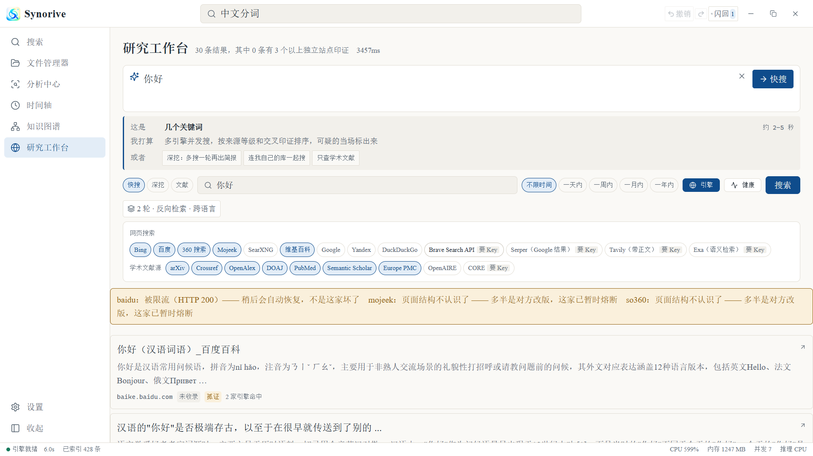

<div align="center">

# Synorive

**本地优先的多模态语义检索 —— 外加一个会自己找反驳材料的联网研究工作台。**

按**意思**搜你自己的文档、代码、PDF、图片和视频，而不是按文件名。
然后多引擎搜全网、主动找打脸材料，出一份**每一行都是逐字原文并挂着出处**的简报。

全离线可用，文件永远不离开你的机器。
自带 **24 个 MCP 工具**给 Claude Code。

[English](../../README.md) · **简体中文** · [Français](README.fr.md) · [Español](README.es.md) · [Русский](README.ru.md) · [العربية](README.ar.md)

[](https://github.com/Aevorine/Synorive/releases/latest)
[](../../LICENSE)
[](https://github.com/Aevorine/Synorive/releases/latest)
[](../../engine)
[](../../apps/desktop)
[](#几个不显然的设计决定)
[](../../mcp)

### ⬇️ 下载

| | |
|---|---|
| **Windows 安装包** | [`Synorive-Setup-0.1.5.exe`](https://github.com/Aevorine/Synorive/releases/latest) —— 自带 Python 运行时，**应用内自动更新** |
| **Windows 便携版** | [`Synorive-0.1.5-portable.exe`](https://github.com/Aevorine/Synorive/releases/latest) —— 免安装；这种形式不支持自动更新 |
| **安卓** | [`app-release.apk`](https://github.com/Aevorine/Synorive/releases/latest) —— 瘦客户端，通过局域网连你电脑上的引擎 |

**不需要你装 Python。** 解释器和引擎的全部依赖都在安装包里，
一台没有 Python、连不上 pip 源、甚至没联网的新机器也能直接启动。

</div>



<div align="center"><sub>

研究工作台：多引擎搜索、逐源可信度分级，以及一个**永远告诉你为什么被过滤**的已排除结果抽屉。
深色主题：[截图](../screenshots/research-dark.png)

</sub></div>

---

## 它做什么

| | |
|---|---|
| 🔍 | **搜自己的东西** —— 文档、源代码、PDF（按章节索引）、图片（OCR）、视频（定位到秒）、网页存档 |
| 🖼 | **跨模态互搜** —— 描述一张图就能找到它，或者**找出某一帧出自哪个视频的第几秒** |
| 🌐 | **多引擎联网搜索** —— cn.bing / 百度 / 360 / Mojeek / 维基百科 / Reddit；自建 SearXNG 后 Google 与 DuckDuckGo 也能用 |
| 🛡 | **主动找打脸证据** —— 反向搜辟谣材料、把一条说法溯源到最早出处、标出已撤稿的论文 |
| 📋 | **只摘录不改写的简报** —— 每一行都是逐字原文并挂着出处。有分歧的说法**并排放着，不替你选** |
| 🔌 | **24 个 MCP 工具给 Claude Code** —— 让你的 agent 直接检索你的库、替你核查一个说法 |
| 🔒 | **隐私围栏** —— 联网搜索和云端推理是**两个独立开关**，因为前者泄露"我在查什么"，后者泄露"我有什么" |
| ❓ | **问一句，答案全是原文** —— 答案**只由你文件里已经存在的句子拼成**，每句带出处。不生成、不改写，一个字都不润色 |
| 📝 | **一键成稿** —— 挑几条结果，直接出 Markdown / 纯文本 / PDF，带编号引用和点得动的锚点 |
| ⚡ | **几秒钟就能搜到** —— 新文件切完块立刻能按关键词搜到，语义索引在后台补，不让你干等 |
| 🎚 | **排序自己调** —— 八个滑块（语义、关键词、时间新鲜度、来源权重、打开热度、标题命中、结果多样性、忽略短片段）、五套预设，还能存自己的 |
| 📖 | **看着不累** —— 纸感主题、三档密度，以及一个真正够大的主输入区（问题长也不憋屈） |

**关键词：** 本地语义检索 · 离线 AI 搜索引擎 · 多模态 RAG · 个人知识库 · 文档检索 ·
向量检索 · 混合检索 · 事实核查 · 谣言识别 · MCP 服务器 · Claude Code · SQLite FTS5 ·
sqlite-vec · HNSW · OCR · 视频检索 · 中文 NLP · Electron 桌面应用 · 隐私优先 · 自托管

---

## 为什么还要再造一个

多数"搜本地文件"的工具停在关键词匹配，多数"AI 研究"工具给你一段流畅但**没法验证**的总结。
这两条 Synorive 都不接受：

- **检索性能是量出来的，不是说出来的。** 下面每一个数字都在真实数据上跑过基准 ——
  **包括两条没达标的**。它们连同原因一起留在表里，而不是被悄悄拿掉。
- **不静默丢弃任何东西。** 被判为低质量而过滤掉的结果进"已排除"抽屉并写明原因，一键找回。
- **它永远不会告诉你某件事是假的。** 它只找出谁在质疑这条说法，把两边摆给你看。
  判断真假不是它具备的能力，装作具备才是它能做的最危险的事。

---

## 现在能跑到哪一步

一到三期、五期、八期已完成。**现在这个应用是真的能用的。**

### 搜自己的东西

- 拖一个混着文档、代码、图片、视频的文件夹进去 → 后台并发索引，界面不卡
- 中文和英文语义搜文档 —— 描述内容就能搜到，不用记文件名
- `type:pdf date:最近7天 -草稿 "精确短语"` 这类语法直接写在搜索框里
- 搜图片**里面**的文字（OCR 实测字符覆盖率 100%）
- 以图搜相似图，或者**找出这一帧出自哪个视频的第几秒**
- 搜一句台词，直接跳到视频的第 3 分 24 秒
- 论文按 Abstract / Method / Results 分节索引，搜到直接标着「第 2 页 · Background」
- 问一篇 PDF **「你能回答哪些问题」**，点一条直接展开那一段原文

### 搜全网并判真假

- 多引擎并发（cn.bing / 百度 / 360 / Mojeek / 维基）；自建 SearXNG 后 **Google 与 DuckDuckGo 也能用**
- 深挖会**读完第一轮再自己想出该追问什么**，然后再搜一轮
- 中文查询自动补一个英文变体，派给英文覆盖更好的引擎 —— 一手资料多半是英文的
- 主动反向搜「辟谣 / 质疑 / 争议 / debunked」，把打脸材料摆到你面前
- 把一条信息**追溯到最早出处**；十几个站两天内发同一件事会被标成「转载爆发」
- 引用的论文**被撤稿了会红字标出来**（走 OpenAlex）
- 五家学术源按 DOI 合并，带被引数和 PDF 链接

### 在 Claude Code 里用

`claude mcp add synorive` 之后，Claude Code 能在同一个回答里检索你的库、核查一个说法，
并把**你自己的资料**和**网上说的**对比着给你。

完整技术方案与 76 项功能菜单见 [`docs/00-技术方案.md`](../00-技术方案.md)。
每条性能指标的目标值、怎么才算测过了、以及**哪些还没测**，都声明在代码里的
[`engine/synorive/metrics.py`](../../engine/synorive/metrics.py)；
基准脚本在 [`engine/tests/`](../../engine/tests)（`bench_g_series` / `bench_research` / `bench_ingest_stages`）。

---

## 实测数据（都是量出来的，不是估的）

| 项 | 实测 | 目标 |
|---|---|---|
| 冷启动到可搜索 | **1.30s** | ≤2.0s ✅ |
| 搜索首屏 @10.2 万块 | P50 **45ms** / P95 **186ms** | ≤80 / ≤200 ✅ |
| 完整检索 @10.2 万块 | P95 **373ms** | ≤500 ✅ |
| 滚动帧率 | **59.9 fps** | ≥55 ✅ |
| 10 万块磁盘占用 | **374 MB** | ≤3 GB ✅ |
| 断点续跑 | 54/54 全跳过，快 1067 倍 | ✅ |
| 图片入库（跳过 OCR） | **19.35 张/秒** | — |
| 图片 OCR（后台补跑） | 1.2~1.5 张/秒 | ← 受限于 Python GIL |
| 视频快速通道 | **88.6 倍速** | — |
| 视频含转写 | 5.97 倍速 | ≥6 ⚠️ |
| 文本向量化（单 worker） | **19.8 块/秒**（原 12.6，批大小 16→8 后 **1.57 倍**） | ⚠️ 见下 |
| 深挖出简报 P95 | **8.29s**（原 23.79s，加全局死线后降 **65%**） | ≤8.0 ⚠️ 差 0.29s |
| 缓存二次命中 | P50 **17.6ms** | ≤200 ✅ |
| 投喂到可搜 | P95 **0.8s** | ≤3.0 ✅ |
| 联网快搜 P95 | **2.4s** | ≤3.0 ✅ |

⚠️ 入库吞吐受限于这台机器（i5-1155G7 / 无独显）：分段计时实测**嵌入这一步占 97.7%**，
其余五步加起来才 2.3%。再要快只能换量化模型或上 GPU，不是继续调参能解决的。

⚠️ 深挖 P95 虽然从 23.79s 降到 8.29s，但**代价是 20/20 次都跳过了第二轮追问**。
数字和它的代价必须一起看。

详见 [`engine/synorive/metrics.py`](../../engine/synorive/metrics.py) 里 A6/A7 两条的 `how` 字段 ——
**目标值那一栏写的是「⚠️ 待重定」而不是一个数字，那是故意的**：
一个明知达不到的数字挂在那儿，比承认「还没定」更糟。

---

## 怎么跑起来

### 一次性准备

```bash
# 1. Node 依赖（Node ≥20）
npm install

# 2. 生成字体子集（6MB，不进仓库，必须自己生成一次）
python scripts/build_fonts.py

# 3. 生成图标（已在仓库里，改了源图才需要重跑）
python scripts/build_icons.py

# 4. Python 引擎环境（Python ≥3.11）
py -3.13 -m venv engine/.venv
engine/.venv/Scripts/python.exe -m pip install -e engine
```

### 开发

```bash
npm run dev              # 起 Electron + Vite 热更新，引擎自动拉起
```

### 构建

```bash
npm run build            # 全部工作区
npm run build:desktop    # 只构建桌面端
npm run pack:win         # 打 Windows 安装包 + 便携版
```

### 发版与自动更新

桌面端和安卓端都能自己检查更新，更新源是这个仓库的 **GitHub Releases**。

```bash
npm run version:check      # 四处版本号是不是一致
npm run version:set 0.1.5  # 一条命令改完四处，别手动改
npm run android:keystore   # 首次：生成安卓 release 签名密钥库（放仓库外）
npm run release            # 出两端产物，**不上传**
npm run release:publish    # 出产物并创建 GitHub Release（要 gh 已登录）
```

发版链路上有四个"漏了也不报错"的坑，`scripts/release.mjs` 会逐个挡住：

| 漏了什么 | 用户那边看到的现象 |
|---|---|
| `latest.yml` 没传 | 桌面端显示**「已是最新」**，不是报错 —— 更新永远到不了 |
| tag 和 `package.json` 版本对不上 | 更新器 404 |
| APK 没传 | 手机端查得到新版但下不了 |
| 安卓 `versionCode` 没 +1 | 手机端显示**「已是最新」** |

**更新链路的安全边界**（写清楚而不是含糊过去）：

| | 桌面端 | 安卓端 |
|---|---|---|
| 传输 | HTTPS | HTTPS，且代码里硬性拒绝非 GitHub 主机 |
| 完整性 | `latest.yml` 里的 sha512，对不上拒绝安装 | 校验字节数是否等于 GitHub 报的资产大小（服务端提前断连时 `read()` 一样返回 −1，不查长度就会拿到一个截断的坏包） |
| 真实性 | ⚠️ **没有代码签名** —— 没买证书，Authenticode 校验会被跳过，装的时候 SmartScreen 会警告"未知发布者" | ✅ 系统校验签名，签名对不上的 APK 根本装不上去 |

桌面端那一格要补只有一条路：买代码签名证书，再在 `electron-builder.yml` 里配 `publisherName`。
**在那之前不要把它宣传成"安全更新"。**

两个已知限制，都是设计上的、不是 bug：

- **便携版不能自动更新** —— 单文件自解压包运行时在临时目录里，替换不了正在运行的自己。
  应用里会明说这一点并给出下载页链接，而不是报错让你反复重试。
- **安卓端要手动确认安装** —— 非应用商店分发只能调系统安装器，首次会要你打开
  「允许安装未知应用」。应用会检测这个权限并直接把你送到那一页。

### 单独跑引擎（调试 / 给 CLI 和 MCP 用）

```bash
engine/.venv/Scripts/python.exe -m synorive.main --port 8731 --data-dir ./data
# 接口文档 http://127.0.0.1:8731/docs
```

### 接进 Claude Code

```bash
npm run build --workspace=@aevorine/synorive-mcp
node scripts/install-claude-integration.mjs
```

装完新开一个 Claude Code 会话，问「我之前存过关于 X 的东西吗」就会自动触发检索。

**24 个工具：**

- **本地库** —— `search` / `ingest` / `analyze` / `get_content` / `similar` / `timeline` /
  `graph` / `status` / `questions`
- **联网** —— `web_search` / `research` / `scholar` / `read_url` / `web_engines` / `verify` /
  `unified_search`
- **文献** —— `scholar_review`（分主题综述，只摘录不改写）、`scholar_table`（同一指标横向抽表）、
  `citations`（共被引找奠基论文）、`harvest`（批量下开放全文并入库，默认干跑）
- **核对与记忆** —— `check_numbers`（数字回原文逐个核对）、`memory`（这个话题以前查过什么）
- **本地媒体** —— `compare`（两个文件哪里不一样）、`chapters`（长视频章节目录）

给 Claude 的返回**强制带可信度分项和出处**，工具描述里写死了能力边界
（"判断不了这句话本身是不是事实"、"逐字摘录不是改写"、"有反驳材料 ≠ 原说法是假的"）——
不写的话 Claude 会把内容农场的说法和官方文档等同看待，再用同样自信的语气转述。

引擎地址是自动发现的（读 `data/engine.json`）：桌面端开着就连同一个引擎，没开就自己起一个。
也可以用 `SYNORIVE_ENGINE_URL` 显式指定。

### 让 Google 和 DuckDuckGo 也能用（可选，但强烈建议）

2026 年 8 月实测：Google 已强制 JavaScript（纯 HTTP 只拿到跳转页）、
DuckDuckGo 的 html 端点改成了 JS 落地页、Yandex 直接给验证码、
**七个 SearXNG 公共实例全部 429/403**。
免费拿到这几家结果，现实里只剩一条路：**自己跑一个 SearXNG。**

```bash
node scripts/setup-searxng.mjs            # 先看它打算做什么（默认干跑，什么都不动）
node scripts/setup-searxng.mjs --apply    # 确认后再真装（要 Docker）
node scripts/setup-searxng.mjs --status   # 看还活着没
```

装完引擎会在冷启动时**自动发现并启用**它，不用去设置里勾。
实测装完后 `google cse` 单独贡献 20 条、DuckDuckGo 10 条 —— 这两家直连时都是零。

---

## 几个不显然的设计决定

- **联网搜索和云端推理是两个开关，不是一个。** 联网搜索泄露的是"我在问什么"，
  云端推理泄露的是"我手上有什么"。这是两种不同的风险，
  合并成一个"隐私模式"会让你关掉了在意的那个、另一个却还开着。
- **剪贴板图片浮窗永不联网** —— 哪怕你开了网页速览。
  文字发出去是一句话，截图发出去是一张可能有任何东西的图。
- **被过滤的结果是折叠不是删除。** 同一篇文章被五家引擎搜到、又被三个站转载，
  这是八条结果但只有一件事。折叠成一条并记下"5 家引擎 / 3 个站点"，
  留下的正是交叉印证要用的那个数字；删掉就白丢了。
- **被限流 ≠ 坏了。** 一家返回验证码的搜索引擎不是解析器坏了。
  两者分开计数，因为"慢一点就好"和"这个适配器已经废了"需要完全相反的处置。
- **没达标的基准照样留在表里。** 上面有两行标着 ⚠️，而不是被删掉。

---

## 许可证

[AGPL-3.0-or-later](../../LICENSE)。如果你把修改过的版本作为网络服务运行，你必须公开你的修改。
